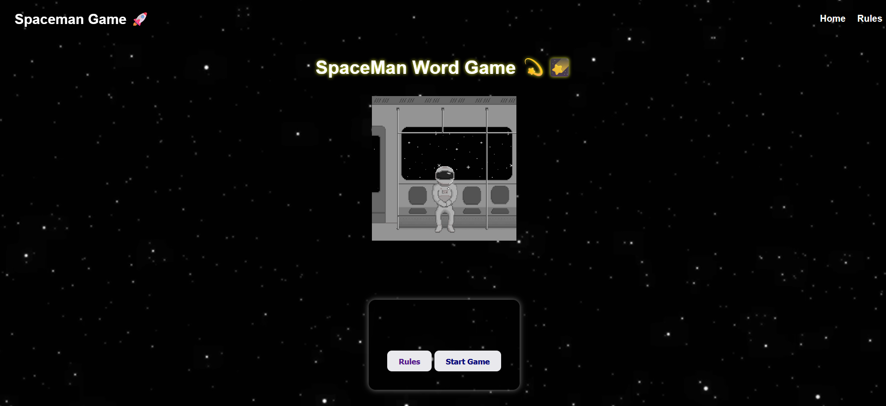
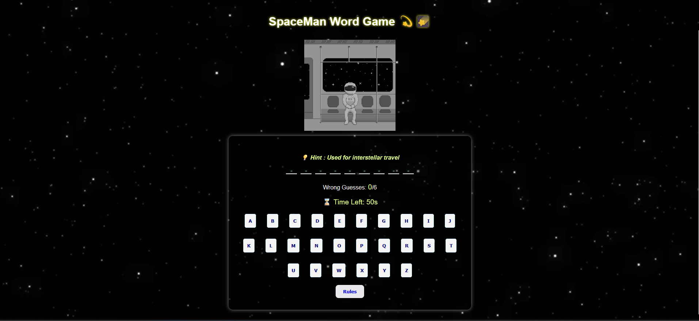
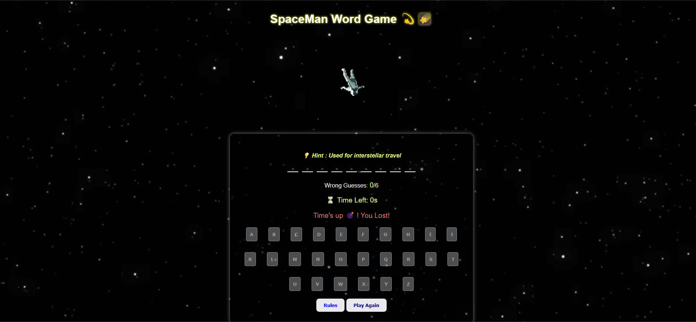

# 🌌 Spaceman Word Game 👨‍🚀

## 🕹️ Description

Spaceman Word Game is a fun, space-themed word guessing game built with **HTML, CSS, and JavaScript**.  
Players must guess the hidden word letter by letter using hints. Wrong guesses are limited, and there's a countdown timer too!  
If the player guesses all letters correctly, the spaceman is saved. If not... game over!

## 🚀 Getting Started

👉 **Play it here:** [https://fatima-abdulhafeez.github.io/SpaceMan-game-project/](https://fatima-abdulhafeez.github.io/SpaceMan-game-project/)

👉 **Planning Materials:**
- [Wireframe](./assets/wireframe.png) 

### 🎯 How to Play

1. Click **Start Game**.
2. Use the hint to guess the word.
3. Click letters to guess.
4. You get 6 wrong guesses max.
5. You also have 60 seconds to win.
6. If you win, the spaceman is saved. If you lose, game over.

## 💡 Technologies Used

- HTML  
- CSS (with Flexbox and animations)  
- JavaScript (DOM manipulation and game logic)

## 🎨 Features

- Word guessing with letter buttons  
- Hints for each word  
- Wrong guess tracking  
- Countdown timer  
- Win/Lose logic with animated GIFs  
- Navigation bar (Home | Rules)  
- Responsive layout and styled UI  

## 📷 Screenshots

| Game Start | Gameplay | Game Over |
|------------|----------|------------|
|  |  |  |

